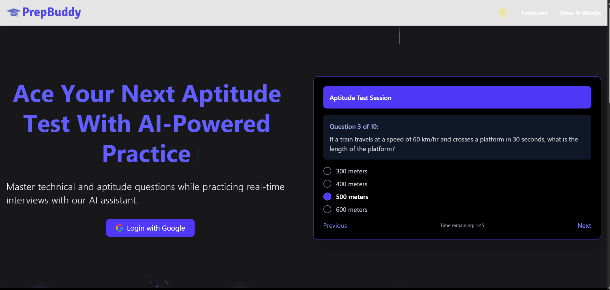
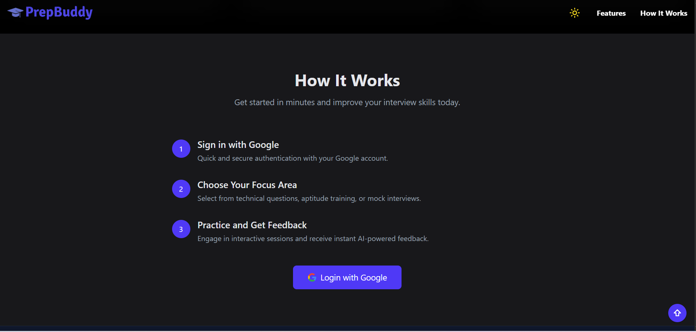

# PrepBuddy

**PrepBuddy** is a placement preparation platform built to help students, crack aptitude rounds of top tech companies. With a collection of aptitude questions from **25+ companies**, user ranking, and DP upload support — it’s your one-stop practice zone!

📌 Click [here](https://prep-buddy-test.vercel.app) to access PrepBuddy.


## ⭐️ Features

- **Aptitude Tests** – Based on real company patterns.
- **User Ranking** – Compare your score with others on the leaderboard.
- **Profile Picture Upload** – Upload and display your DP via Cloudinary.
- **Gmail Login** – Secure login using Firebase authentication.
- **Performance Tracking** – Know your total points and attempts.
- **Unlockable Badges** – Earn achievement badges as you progress and perform better.
  

## ⭐️ Tech Stack

### Frontend
- React + Vite (TypeScript)
- Tailwind CSS
- ShadCN/UI & Lucide Icons
- Axios

### Backend
- Node.js + Express.js
- MongoDB + Mongoose
- Firebase Auth
- Cloudinary + Multer


## ⭐️ Badges


## ⭐️ Preview

<details>
<summary><strong>Hero Section</strong></summary>



</details>

<details>
<summary><strong>Feature Highlights</strong></summary>

.png)

</details>

<details>
<summary><strong>Night Mode View</strong></summary>


</details>

<details>
<summary><strong>How it works</strong></summary>



</details>


## ⭐️ Contributions

We love open source. Feel free to contribute and make PrepBuddy even better!

### How to Contribute?


📌 First, raise the issue you want to work on. Only when it is assigned to you, follow the steps below. 

1. Fork this repo.

2. Clone the repo:

   ```bash
   git clone <forked-repo-url>
   ```

3. Create a new branch:  

   ```bash
   git checkout -b <your-feature-name>
   ```

3. Make your changes.

4. Commit your changes: 

   ```bash
   git commit -m "Added feature"
   ```

5. Push to your fork:  

   ```bash
   git push origin <your-feature-name>
   ```

📌 `your-feature-name` simply means the new branch you created. 


6. Open a Pull Request

We'll review your PR soon!


# Thanks to our fellow Contributors!

<a href="https://github.com/SurajSG23/PrepBuddy/graphs/contributors">
  
</a>